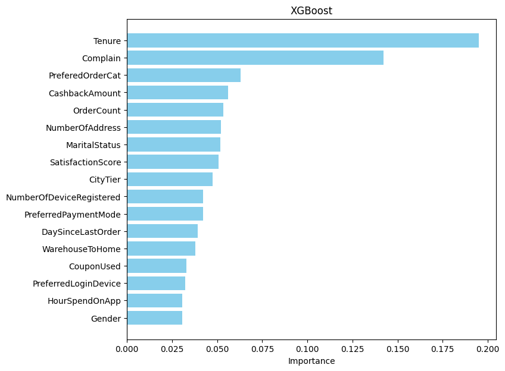

# SKN05-2ND-4TEAM

### 📈2차 프로젝트: 전자상거래 고객 이탈 분석 및 예측  
 **개발기간: 2024.10.16-10.17**

## 💻팀 소개
**팀명** 
김이박조

**팀원**

|  **김요은👩‍💻** |  **이준호👨‍💻** |  **김혜서👩‍💻** |  **박보람👩‍💻** |
|:---------:|:---------:|:---------:|:-----------:|
| @usey10 | @Lanvizu | @Hyeseo20 |  @pbr2858 |

### 1. 프로젝트 개요

<blockquote>

  
  이커머스 시장은 폭발적인 성장 속에 경쟁이 치열해지고 있습니다. 
  소비자들은 다양한 선택지를 가지고 있기 때문에, 고객 이탈은 큰 손실로 이어질 수 있습니다. 
   시장 규모가 커질수록 고객 유지의 중요성은 더욱 커지며, 이탈 예측은 이를 해결할 핵심 도구로 떠오릅니다. 
   따라서 맞춤형 서비스 제공과 충성도 유지를 위해 고객 이탈 예측은 필수적입니다.
</blockquote>

 

#### 1.2. 프로젝트 소개
<blockquote>
•	이 프로젝트를 통해 데이터 기반으로 고객 이탈에 대한 분석 내용을 제공합니다. 
•	 고객 이탈 분석 및 예측을 통해 이탈 고객의 행동 패턴을 분석하고, 이탈 가능성이 높은 고객을 사전에 예측하고자 합니다.  
•	이를 통해 이탈률이 높은 변수에 대한 적절한 전략을 마련할 수 있습니다. 
</blockquote>

#### 1.3. 프로젝트 목표
<blockquote>

1.	고객 이탈 가능성을 조기에 감지 
2.	그 원인을 분석해 유용한 정보를 제공 
• 이를 통해 기업은 고객 유지를 위한 맞춤형 전략을 수립할 수 있으며, 고객 이탈을 줄이는 데 필요한 통찰을 얻게 됩니다. 
</blockquote>
   

### 기술 스택
 </a>
 </a>
 

### 2. EDA

|  | |  |  |
|:-----------------------------------:|:-------------------------------------:|:-----------------------------------:|:-------------------------------------:|
| 변수당 고유값에 따른 이탈률 |변수당 고유값 비율 | 변수당 고유값 수 | Boxplot   |

|  |
|:-------------------------------------:|
| Heatmap   |

### 3. 데이터 전처리
- #### 결측값 처리 방법
| 변수명 | 결측값 처리방법 | 결측값 처리 방법 - 이유 |
|:-----------------------------------:|:-------------------------------------:|:-----------------------------------:|
| Tenure |61과 71 사이의 임의의 수 대치 | 60개월 이후의 숫자가 없어서 사이트가 생기기 전에 가입되어 있던 고객일 가능성 有 | 
| WarehouseToHome |결측값을 모두 0으로 대치 | 자료에 0 의 값이 없어 매장 방문을 하지 않아 결측값으로 표시 될거라 판단 | 
| HourSpendOnApp |결측값이 있는 행을 제거 | 자료에 0이 이미 있어, 추정 불가로 행 제거 | 
| OrderAmountHikeFromlastYear |열을 데이터 프레임에서 제거 | 증가량이 미미하며, 감소한 추세가 보이지 않아 열 자체를 제거 | 
| CouponUsed |결측값을 모두 0으로 대치 | 자료에 0 의 값이 없어 쿠폰을 사용 하지 않아 결측값으로 표시 될거라 판단 | 
| DaySinceLastOrder |결측값이 있는 행을 제거 | 자료에 0이 이미 있어, 추정 불가로 행 제거 |
| DaySinceLastOrder |30,31,46 인 행을 필러링 후 제거 | boxplot 을 확인하여 봤을 때 30 이상의 수는 극단적 이상치라 성능 저하가 될 수 있다 판단 |

- #### 라밸 인코더 
| 변수명 | 라벨 인코딩 후 |
|:-----------------------------------:|:-------------------------------------:|
| PreferredLoginDevice  | 0 ~ 2 |
|PreferredLoginDevice  |0 ~ 6 |
|Gender   | 0 ~ 1|
| PreferedOrderCat   |0 ~ 5 |
| MaritalStatus   |0 ~ 2 |

- #### 스케일링한 변수
|CustomerID |CityTier |WarehouseToHome | 
|:-----------------------------------:|:-------------------------------------:|:-----------------------------------:|
|HourSpendOnApp |NumberOfDeviceRegistered| SatisfactionScore | 
| NumberOfAddress |Complain |CouponUsed | 
| OrderCount |DaySinceLastOrder | CashbackAmount | 

### 4. 모델링 & 하이퍼 파라메터 튜닝

- #### 초기 성능 확인
|  | 
|:-------------------------------------:|

- #### 1차 성능 개선
|  | 
|:-------------------------------------:|
|  | 
|  | 

- #### 2차 성능 개선
|  | 
|:-------------------------------------:|

- #### 최종 모델 분석
|  | | 
|:-----------------------------------:|:-------------------------------------:|
| adaboost | xgboost |
|  | | 
| mlp | catboost |
|  | | 
|logistic regression |randomforest |
|  | | 
| decision tree |gradient boosting|

• 모델들을 비교해 봤을 떄 Tenure, Complain, CashbackAmount 총 세 변수가 중요하다고 판단 

### 5. 예측
#### 이탈률 비교
•	 Test Data 에 대한 이탈률 예측 비교  
• 실제 데이터를 가지고 도출한 이탈률 : 16.29%  
• 예측 데이터를 가지고 도출한 이탈률 : 15.60%  
• 예측 데이터의 이탈률이 실제 데이터와 상당히 비슷한 확률을 보여 예측이 잘 되었다고 생각.  
|  | | 
|:-----------------------------------:|:-------------------------------------:|

#### Tenure, Complain, CashbackAmount 에 대한 이탈률 확인
- #### Tenure
| | 
|:-------------------------------------:|
|61개월 이상 가입했던 고객과, 0개월~1개월 의 가입기간을 가지는 고객의 이탈률이 높음.  
장기 가입 고객 및 신규 가입 고객이 지속적으로 이용할 수 있는 마케팅 전략이 필요하다고 판단됨.|

- #### Complain
| | 
|:-------------------------------------:|
|complain 을 낸 사람들의 이탈률이 높음을 알 수 있음. 
complain 고객의 관리 전략이 필요하다고 판단됨.|

- #### CashbackAmount
| | 
|:-------------------------------------:|
|지난달에 고객들이 얼마나 Cashback 을 받았는지에 대한 지표  
지난달 캐시백을 100 달러 미만 받은 고객은 오히려 이탈률이 없었으나,  100달러 단위와 비슷하게 캐시백을 받은 고객의 이탈률이 조금 존재하는 편. 
100 달러 단위의 할인 정책이 있지 않을까 예측 
고객의 캐시백 정보에 대한 데이터의 추가적인 분석이 필요하다고 판단됨.|

### 6. 결론

| **위 피처들을 통한 이탈 방지 전략을 구현을 제안** |
|:-------------------------------------:|
| 장기 가입 고객 및 신규 가입 고객 타겟의 마케팅 전략  컴플레인 고객 관리 전략  캐시백 정보에 대한 추가적 분석 |

 
### 7. 한 줄 회고

<blockquote>

•	김요은 : 다 같이 한 과정 한 과정 진행했음에 즐거웠고 여러 모델을 돌리면서 각 모델에 대해 더 알아보고 이해할 수 있는 좋은 시간이었습니다.  
•	이준호 :  
•	김혜서 : 프로젝트를 통해 데이터 분석에 대한 이해도가 높아지고 이에 대한 공부를 할 수 있는 기회였습니다  
•	박보람 : 거의 모든 과정을 팀원들과 같이 나누어 진행하여 하나씩 경험할 수 있어 너무 좋았다. 프로젝트를 진행하면서 통계 지식이 부족함을 깨달았고, 기초부터 다시 공부하고 싶다는 생각을 했다.

</blockquote>
