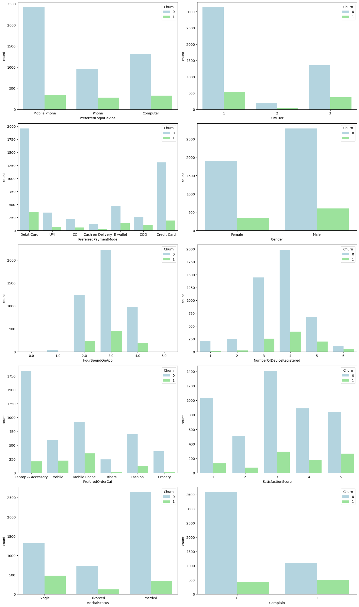

# SKN05-2ND-4TEAM

### 📈2차 프로젝트: 전자상거래 고객 이탈 분석 및 예측  
 **개발기간: 2024.10.16-10.17**

## 💻팀 소개
**팀명** 
김이박조

**팀원**

|  **김요은👩‍💻** |  **이준호👨‍💻** |  **김혜서👩‍💻** |  **박보람👩‍💻** |
|:---------:|:---------:|:---------:|:-----------:|
| @usey10 | @Lanvizu | @Hyeseo20 |  @pbr2858 |

# 1. 프로젝트 개요

<blockquote>
 
 
이커머스 시장은 폭발적인 성장 속에 경쟁이 치열해지고 있습니다. 소비자들은 다양한 선택지를 가지고 있기 때문에, 고객 이탈은 큰 손실로 이어질 수 있습니다.  
시장이 커질수록 고객 유지의 중요성도 더욱 커지며, 이탈 예측은 이를 해결하는 핵심 도구로 떠오릅니다.  
맞춤형 서비스 제공과 충성도 유지를 위해 고객 이탈 예측은 필수적입니다.  
따라서 이커머스 기업이 성공적으로 경쟁하려면 이탈 예측이 필수적입니다.
</blockquote>

---

## 1.2. 프로젝트 소개
<blockquote>
- 고객 이탈 분석 및 예측은 데이터를 활용해 고객의 행동 패턴을 분석하고, 이탈 가능성이 높은 고객을 사전에 예측하는 방법입니다.  
- 이를 통해 고객 이탈 전에 관련 정보를 제공하여 적절한 대응책을 마련할 수 있습니다.  
- 이 프로젝트의 목적은 데이터를 기반으로 고객 이탈에 대한 통찰을 제공하는 것입니다.
</blockquote>

---

## 1.3. 프로젝트 필요성(배경)
<blockquote>
- 경쟁이 치열한 이커머스 시장에서 고객 이탈은 기업의 주요 손실 요인입니다.  
- 이탈하는 고객을 예측함으로써 기업은 이를 방지하고 고객을 유지할 수 있습니다.  
- 이 프로젝트는 기업이 이탈 방지 전략을 세울 수 있도록 데이터를 제공하여 비용 절감과 수익 증대를 돕는 것을 목적으로 합니다.
</blockquote>

---

## 1.4. 프로젝트 목표
<blockquote>
1. 고객 이탈 가능성을 조기에 감지  
2. 이탈 원인을 분석해 유용한 정보를 제공  

- 이를 통해 기업은 고객 유지를 위한 맞춤형 전략을 수립하고, 고객 이탈을 줄이는 데 필요한 통찰을 얻게 됩니다.
</blockquote>

## 기술 스택
 </a>
 </a>
 

### 2. EDA

|  | |  |  |
|:-----------------------------------:|:-------------------------------------:|:-----------------------------------:|:-------------------------------------:|
| 변수당 고유값에 따른 이탈률 |변수당 고유값 비율 | 변수당 고유값 수 | Boxplot   |

 
### 8. 한 줄 회고

<blockquote>

•	김요은 :  
•	이준호 :  
•	김혜서 : 프로젝트를 통해 데이터 분석에 대한 이해도가 높아지고 이에 대한 공부를 할 수 있는 기회였습니다  
•	박보람 : 거의 모든 과정을 팀원들과 같이 나누어 진행하여 하나씩 경험할 수 있어 너무 좋았다. 프로젝트를 진행하면서 통계 지식이 부족함을 깨달았고, 기초부터 다시 공부하고 싶다는 생각을 했다.

</blockquote>
